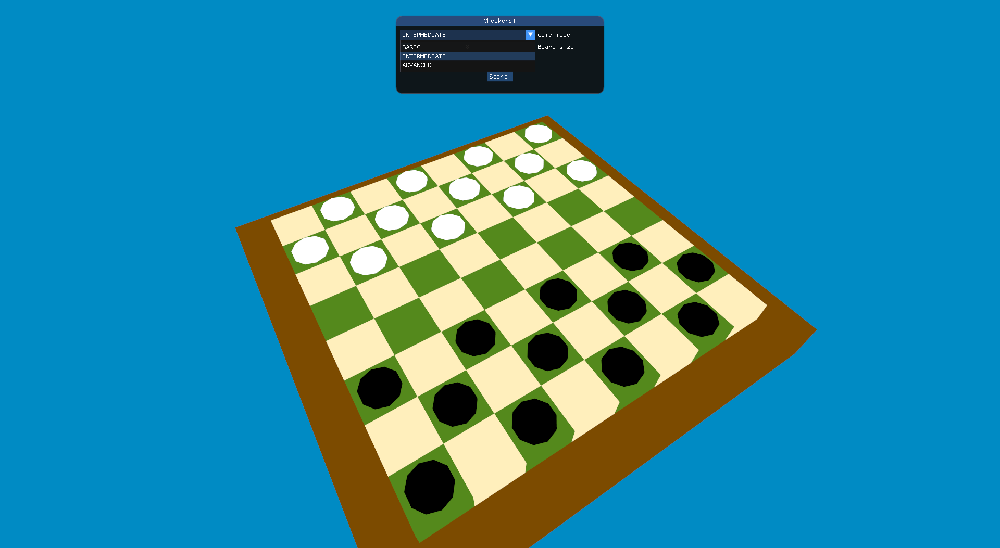
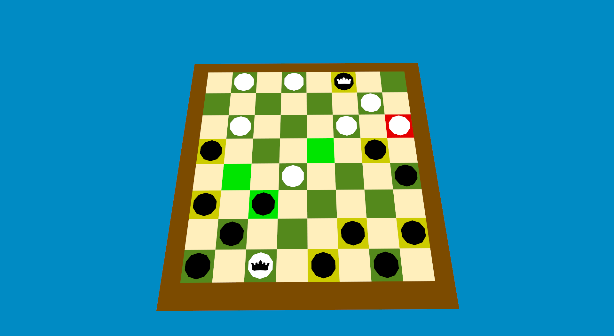
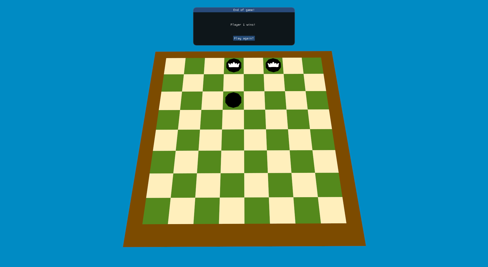

# Checkers 3D

### Description

This project is my implementation of the game checkers using a 3D engine on top of OpenGL for my final
project in Programming of my first year in university.

### Project layout

The project is split into 2 different base level packages:

- `io.github.davfsa.checkers_3d.engine`:
    - Contains OpenGL specific logic to render a 3D environment and a gui.

- `io.github.davfsa.checkers_3d.game`
    - Contains logic and definitions for the game and gui.

There is an additional folder (`src/main/resources`) which contains the following items:

- `/models`: .obj files for the 3D models.
- `/shaders`: shader files (.frag and .vert) for GPU based rendering.

### Requirements

A minimum of Java 17 is required to run this project.

### Running the project

To run the project, it as simple as executing:

```bash
$ ./mvnw clean compile exec:java
```

### Keybindings

- Esc: Exit application
- 0 (zero): Set camera to top-view (*)
- W: Toggle wireframe mode (*)
- Right-click: Interact with items
- Left-click + mouse move: Move the view (*)

(*) These keybindings only work while in the main game, not in the menu

### Screenshots






