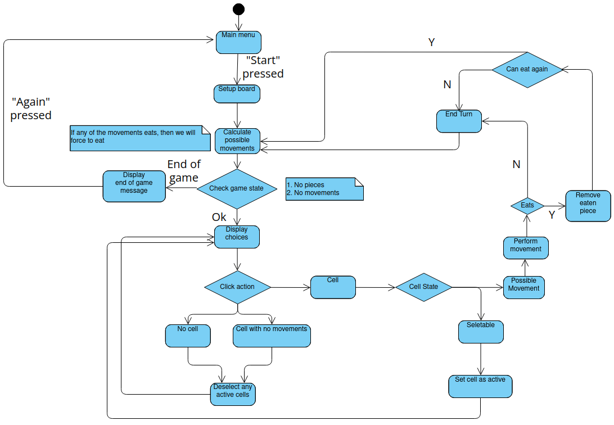
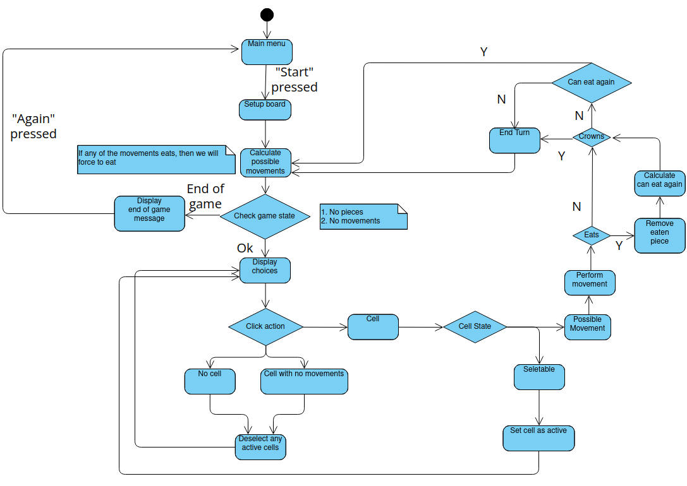
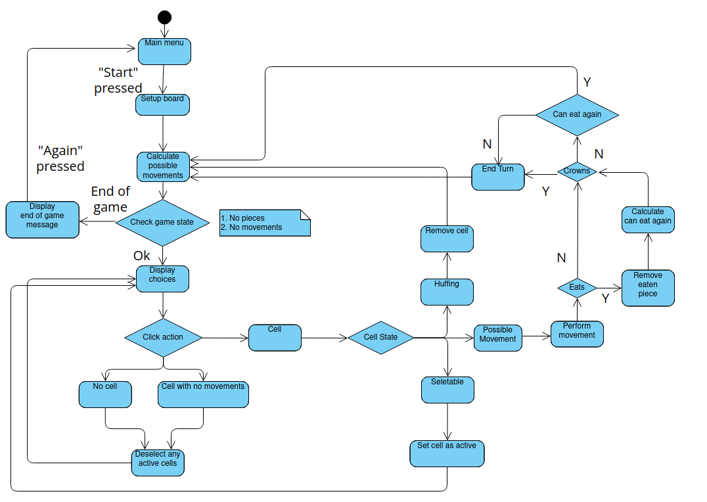

## Technologies used

This project makes use of 2 main libraries and some helper libraries:

- `lwjgl`: OpenGL and GLFW Java bindings.
- `imgui-java-binding`: Java bindings for the Dear IMGui library.
- `joml`: OpenGL math helpers.
- `tinylog`: Java light logging module.

## Ideas and thoughts behind the project

When we were first proposed the project, I already knew an easy way to implement it all
in pure java, but I wanted to learn something from this project, which is why I decided
to have a go at implementing the game in 3D using OpenGL to learn a bit from this
project. I found a [LWJGL tutorial] that helped me get started with OpenGL (a technology
I had never before used in Java) and build the basis of the engine to render, display and
manage the window making use of OpenGL and [GLFW].

As I went through the tutorial and experimented with the engine I was building and was
happy with the results, I started to design and implement the actual checkers game. It
was relatively easy to implement logic wise with problems arising in the engine side
of the project, where I found myself stuck for days trying to get things to work. The
most noticeable time-consuming process was reading through and implementing [ray-casting],
which was not only hard to wrap my head around, but also took a lot of long hours
implementing the theory math correctly and (a bug that I was stuck on for 2 days) realizing
I had to divide the minimum and the maximum of my AABB (Axis-Aligned Bounding Box) by 2 as
my models were 1 unit per side.

The game logic for each game mode is described in these flow charts:

**Basic flow-chart:**

**Intermediate flow-chart:**

**Advanced flow-chart:**

Once I was done implementing the base game with all the required game-modes (beginner,
intermediate and advanced), I focused on implementing a GUI system to show game screens
and take in user input to decide the game mode to play. To do this I turned to the [IMGui docs]
and experimented until I ended with a design and implementation I was happy with. During
this time I also found and submitted a [bugfix] to the Dear IMGui Java binding library
I was using.

I also attempted to implement Gaussian blur to blur the screen while the menu were active
to shift away the focus from the board to the menu, but after several days of trying to
implement it, I saw that to do it correctly and have it functioning well, I would have to
implement textures, which is something that the engine *could* handle easily, but I decided
not to due to how much work and complexity that would bring versus the benefits of that.

[GLFW]: https://www.glfw.org/

[LWJGL tutorial]: https://ahbejarano.gitbook.io/lwjglgamedev/

[ray-casting]: https://antongerdelan.net/opengl/raycasting.html

[LWJGL tutorial]: https://ahbejarano.gitbook.io/lwjglgamedev/

[IMGui docs]: https://github.com/ocornut/imgui/wiki

[bugfix]: https://github.com/SpaiR/imgui-java/pull/143
